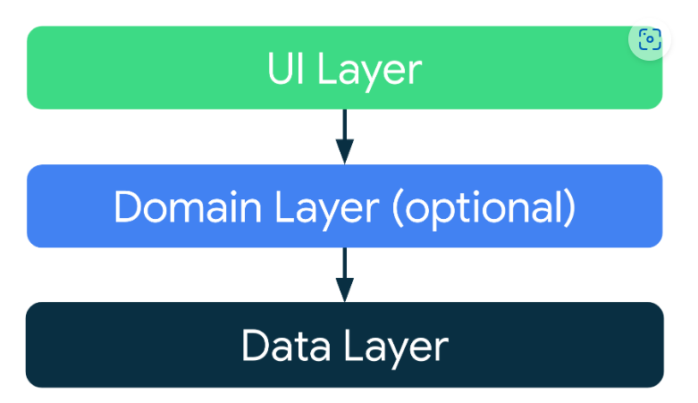

# App Fluxo de Carrefour

---

## Desenho da arquitetura

## Padrões de projeto utilizados
- Injeção de dependências
- Service Locator
- Singleton

## Tecnologias e Libs
- Hilt
- Jetpack Composa
- Room
- Firebase Authentication (Não implementado ainda)
- Mockito
- Hamcrest

## Como usar o App
1. Clone o repositório.
2. Execute o projeto no Android Studio e abra o app no seu dispositivo ou emulador..
3. Na primeira tela clique no botão "Log In"
4. Clique no botão "Caixa" e preencha os campos da tela de Caixa para poder criar um registro de caixa.
5. No fim da jornada de cadastro, caso sucesso, você voltará a tela inicial com as 2 opções: "Caixa" e "Relatórios"
6. Clique em "Relatórios" para ver os registros do dia. (caso queira um compilado de datas mais antigas, use o botão "Abrir calendário" e escolha uma data retroativa).

## Testes

